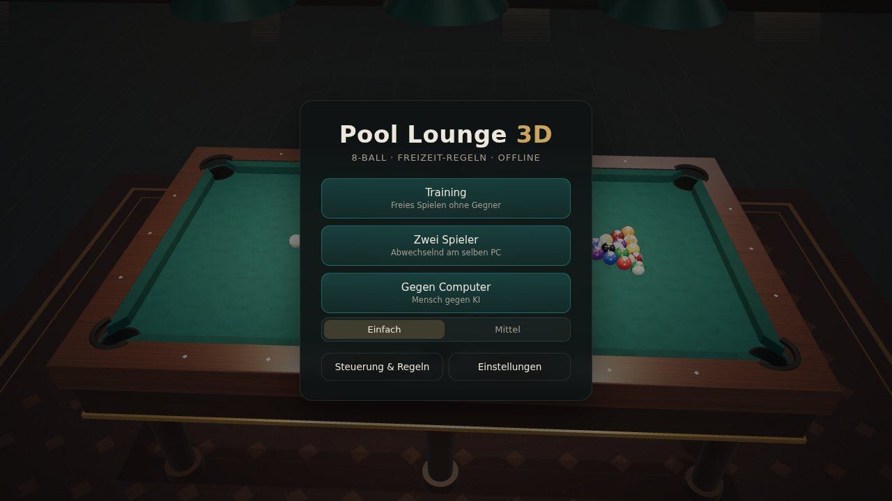
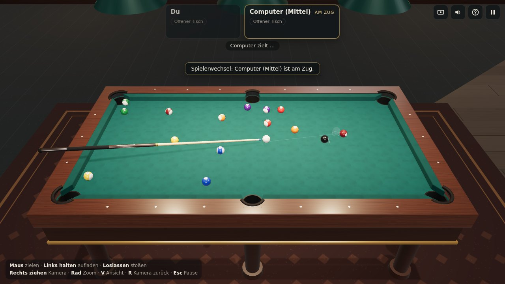
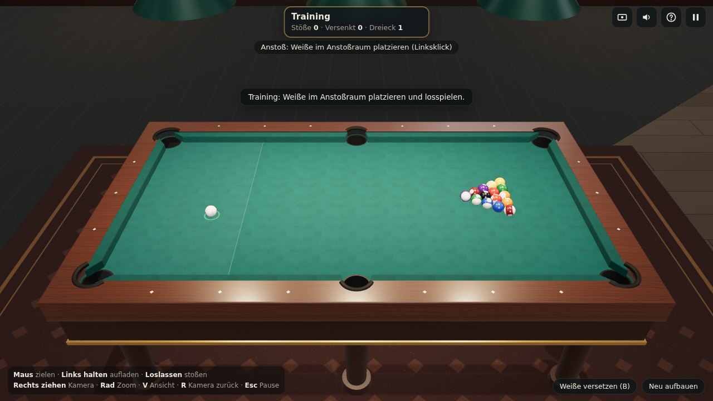
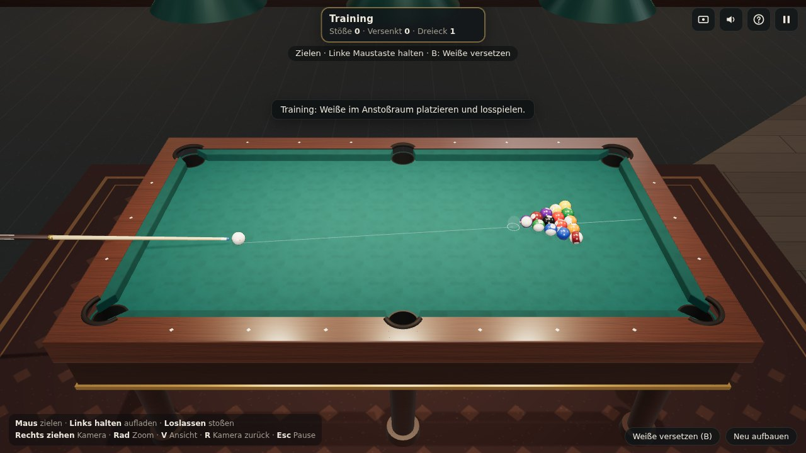
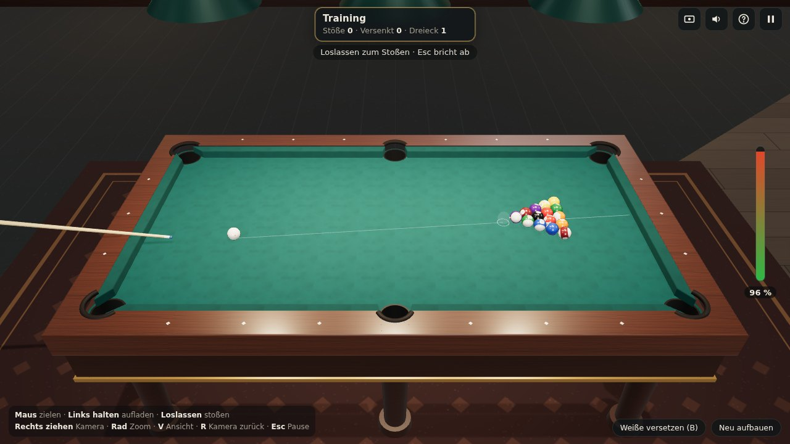
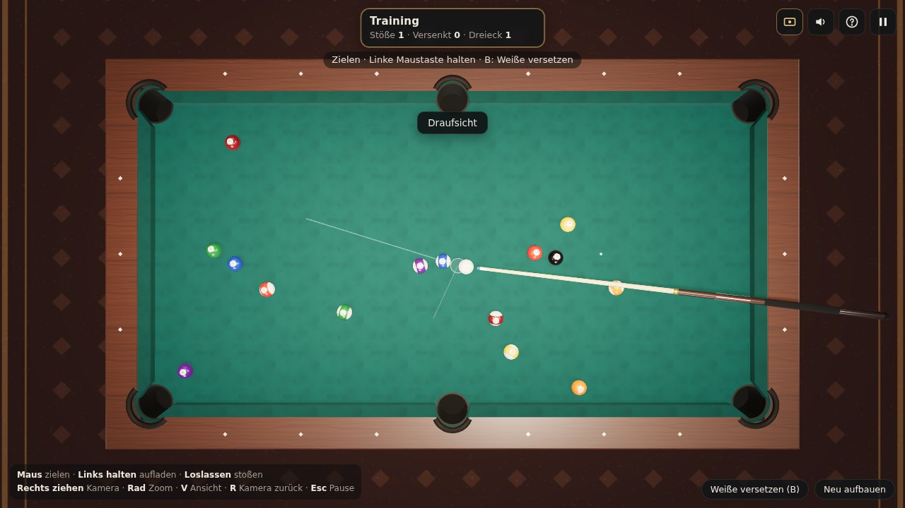
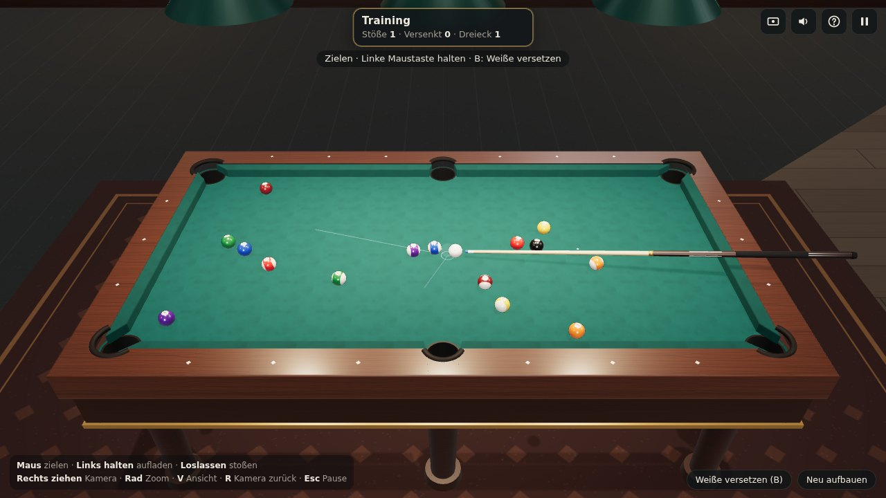
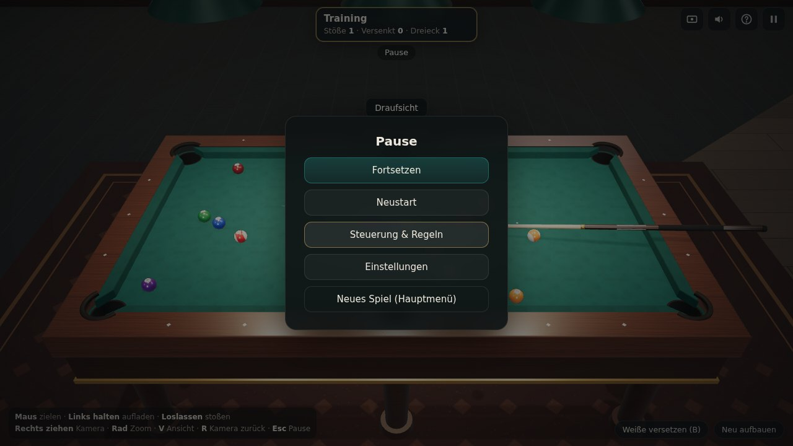

# Spielanleitung – Pool Lounge 3D

Willkommen in der Pool Lounge! Diese Anleitung erklärt Schritt für Schritt, wie du das Spiel startest, zielst,
stößt und nach den Freizeit-Regeln für 8-Ball spielst.

**Inhalt**

1. [Spiel starten](#1-spiel-starten)
2. [Spielmodi](#2-spielmodi)
3. [Der Bildschirm im Überblick](#3-der-bildschirm-im-überblick)
4. [Weiße platzieren (Ball in Hand)](#4-weiße-platzieren-ball-in-hand)
5. [Zielen und Stoßen](#5-zielen-und-stoßen)
6. [Kamera und Ansichten](#6-kamera-und-ansichten)
7. [Training und Zielhilfe](#7-training-und-zielhilfe)
8. [Gegen den Computer](#8-gegen-den-computer)
9. [Die Regeln in Kürze](#9-die-regeln-in-kürze)
10. [Pause, Einstellungen und Ton](#10-pause-einstellungen-und-ton)
11. [Tipps für bessere Stöße](#11-tipps-für-bessere-stöße)
12. [Tastenübersicht](#12-tastenübersicht)
13. [Probleme lösen](#13-probleme-lösen)

---

## 1. Spiel starten

**Online (ohne Installation):** <https://ckju1806.github.io/Queue-3D/> im Browser öffnen – fertig.

**Lokal auf dem PC (Windows):**

1. [Node.js LTS](https://nodejs.org) installieren (Standardoptionen genügen).
2. Das Projekt von GitHub herunterladen: auf der Repository-Seite **Code → Download ZIP** wählen und die ZIP-Datei entpacken
   (oder `git clone https://github.com/ckju1806/Queue-3D.git`).
3. Im entpackten Ordner die Eingabeaufforderung öffnen: im Explorer in die Adresszeile `cmd` eingeben und Enter drücken.
4. Einmalig `npm install` ausführen, danach `npm run dev`.
5. Im Browser <http://localhost:5173> öffnen.

Empfohlen sind ein aktueller Chrome, Edge oder Firefox mit aktivierter Hardwarebeschleunigung.

Im **Hauptmenü** wählst du den Spielmodus. Beim Modus „Gegen Computer“ stellst du darunter die Schwierigkeit ein
(*Einfach* oder *Mittel*). Über **Steuerung & Regeln** und **Einstellungen** erreichst du Hilfe und Lautstärke.

## 2. Spielmodi

| Modus | Für wen? | Besonderheiten |
|---|---|---|
| **Training** | Allein üben | Keine Gegner, keine Niederlage. Die Weiße kann bei ruhendem Tisch jederzeit neu platziert werden (Taste **B**). Ist der Tisch abgeräumt, wird automatisch ein neues Dreieck aufgebaut. |
| **Zwei Spieler** | Zu zweit an einem PC | Ihr stoßt abwechselnd nach den 8-Ball-Regeln. |
| **Gegen Computer** | Allein gegen die KI | *Einfach*: macht deutlich mehr Fehler. *Mittel*: wählt Stöße sorgfältiger und trifft genauer. |

## 3. Der Bildschirm im Überblick

- **Spielerkarten (oben Mitte):** Name, Gruppe (*Offener Tisch*, *Volle 1–7* oder *Halbe 9–15*) und die noch
  liegenden Kugeln der Gruppe. Die Karte des aktiven Spielers ist hervorgehoben und trägt den Hinweis **AM ZUG**
  bzw. **BALL IN HAND**. Leuchtet die kleine 8 auf der Karte, darf dieser Spieler auf die 8 spielen.
- **Statuszeile (darunter):** sagt dir, was gerade zu tun ist, z. B. „Zielen · Linke Maustaste halten“.
- **Versenkt:** eine Leiste mit allen bisher versenkten Kugeln.
- **Meldungen:** Fouls, Spielerwechsel und Gruppenzuordnung erscheinen kurz in der Bildmitte oben.
- **Symbole oben rechts:** Ansicht wechseln, Ton an/aus, Steuerungshinweise ein-/ausblenden, Pause.
- **Stärkeanzeige (rechts):** erscheint beim Aufladen und zeigt die Stoßstärke in Prozent.
- **Steuerungshinweise (unten links):** eine Kurzfassung der Bedienung (Taste **H** blendet sie aus).

## 4. Weiße platzieren (Ball in Hand)

Zu Beginn jeder Partie und nach einem Foul des Gegners hast du **Ball in Hand**:

1. Bewege die Maus über den Tisch – die Weiße folgt dem Mauszeiger.
2. Der Ring unter der Kugel zeigt, ob die Position erlaubt ist: **grün = gültig**, **rot = ungültig**
   (Überschneidung mit einer Kugel, zu nah an einer Tasche oder außerhalb der Spielfläche).
3. **Linksklick** legt die Weiße ab.

Beim **Anstoß** darfst du die Weiße nur im **Anstoßraum** platzieren – dem hellen Bereich links der Linie.
Nach einem Foul ist der ganze Tisch erlaubt. Solange du noch nicht gestoßen hast, kannst du die Weiße mit **B**
wieder aufnehmen und neu setzen.

## 5. Zielen und Stoßen

1. **Zielen:** Bewege die Maus über den Tisch. Der Queue dreht sich mit, eine dezente Linie zeigt die Stoßrichtung.
   Der Kreis am Ende der Linie ist die **Geisterkugel**: So steht die Weiße im Moment der Berührung. Der kleine helle
   Punkt markiert den Kontaktpunkt auf der getroffenen Kugel.
2. **Feinjustieren:** Mit den Pfeiltasten **←/→** drehst du die Richtung in kleinen Schritten, mit gedrückter
   **Umschalt**-Taste in größeren.
3. **Aufladen:** Halte die **linke Maustaste** gedrückt. Der Queue zieht zurück, rechts steigt die Stärkeanzeige.
   Nach etwa 1,3 Sekunden ist die volle Stärke erreicht.
4. **Stoßen:** Lass die Maustaste los – der Queue schnellt nach vorn und trifft die Weiße.
5. **Abbrechen:** **Esc** oder die rechte Maustaste bricht das Aufladen ab, ohne zu stoßen.

Farben der Geisterkugel:

- **Weiß** – erlaubter Stoß.
- **Rot** – die zuerst getroffene Kugel wäre nicht erlaubt (Foul).
- **Orange** – die Weiße würde direkt in eine Tasche laufen.

Ein sehr kurzer Klick zählt nicht als Stoß – so passiert nichts aus Versehen. Solange Kugeln rollen oder der Computer
am Zug ist, sind Stöße gesperrt.

## 6. Kamera und Ansichten

| Aktion | Bedienung |
|---|---|
| Um den Tisch drehen | Rechte Maustaste gedrückt halten und ziehen |
| Heran- und herauszoomen | Mausrad |
| Perspektive ↔ Draufsicht | Taste **V** (oder Symbol oben rechts) |
| Kamera zurücksetzen | Taste **R** |

Die **Draufsicht** eignet sich gut, um Winkel genau abzuschätzen. In der Perspektive wirkt das Spiel räumlicher.

## 7. Training und Zielhilfe

Im Training zeigt die Zielhilfe zusätzlich, wohin die Kugeln nach dem Kontakt laufen:

- **grünliche Linie** – Laufrichtung der getroffenen Kugel (je länger, desto mehr Tempo bekommt sie),
- **bläuliche Linie** – Laufrichtung der Weißen nach dem Kontakt,
- bei einem Bandenkontakt die Richtung, in die die Weiße abprallt.

Diese Hilfe lässt sich in den **Einstellungen** abschalten. Unten rechts findest du im Training die Knöpfe
**Weiße versetzen (B)** und **Neu aufbauen**.

## 8. Gegen den Computer

- Du hast den ersten Anstoß; bei einer **Revanche** wechselt das Anstoßrecht.
- Ist der Computer am Zug, erscheint „Computer überlegt …“. Danach siehst du, wie er zielt, die Stärke auflädt und stößt –
  mit denselben Regeln und derselben Physik wie du.
- Bei Ball in Hand platziert der Computer die Weiße selbst.
- *Einfach* ist gut zum Einstieg; *Mittel* spielt deutlich sicherer.

## 9. Die Regeln in Kürze

Pool Lounge 3D nutzt ein **vereinfachtes Freizeit-Regelwerk für 8-Ball** (keine offiziellen Turnierregeln):

- **Ziel:** Erst die eigene Gruppe versenken – **volle Kugeln 1–7** oder **halbe (gestreifte) Kugeln 9–15** –,
  danach die **schwarze 8**. Taschen müssen nicht angesagt werden.
- **Anstoß:** Fällt mindestens eine Kugel, bleibst du am Zug. Danach ist der Tisch **offen**. Fällt die 8 beim Anstoß,
  wird sie wieder aufgesetzt – das entscheidet noch nichts.
- **Gruppe festlegen:** Versenkst du bei offenem Tisch ohne Foul nur Kugeln einer Gruppe, gehört dir diese Gruppe.
  Fallen Kugeln beider Gruppen, bleibt der Tisch offen, und du spielst weiter.
- **Weiterspielen:** Wer ohne Foul eine eigene Kugel versenkt, bleibt am Zug. Sonst ist der Gegner dran.
- **Fouls** (der Gegner bekommt Ball in Hand):
  - Die Weiße fällt in eine Tasche.
  - Die Weiße trifft keine Kugel.
  - Die Weiße trifft zuerst eine falsche Kugel (eine gegnerische, oder die 8, bevor du darfst).
  - Nach dem Kontakt fällt keine Kugel und keine Kugel berührt eine Bande.
- **Schwarze 8:** Erst spielen, wenn die eigene Gruppe **zu Beginn des Stoßes** komplett versenkt ist.
  Korrekt versenkt = **gewonnen**. Zu früh oder zusammen mit einem Foul versenkt = **verloren**.

Die vollständigen Regeln stehen in der [README](../README.md#verwendetes-freizeit-regelwerk-8-ball-vereinfacht).

## 10. Pause, Einstellungen und Ton

- **Esc** (oder das Pause-Symbol) öffnet das **Pausemenü**: Fortsetzen, Neustart, Steuerung & Regeln, Einstellungen
  oder zurück zum Hauptmenü. Während der Pause steht das Spiel still.
- **Einstellungen:** Lautstärke, Stummschaltung, Zielhilfe im Training, Steuerungshinweise. Sie werden im Browser
  gespeichert.
- **Ton:** Klänge gibt es für Queue-Stoß, Kugelkontakte, Banden, Taschen und das Spielende. Browser geben Ton erst nach
  dem ersten Klick frei. **M** schaltet den Ton an und aus.
- Am **Spielende** zeigt die Ergebnisanzeige Gewinner, Grund und eine kleine Statistik – mit **Revanche** geht es direkt weiter.

## 11. Tipps für bessere Stöße

- **Geisterkugel nutzen:** Lege die Geisterkugel genau hinter die Objektkugel – auf die gedachte Linie von der Tasche
  durch die Kugel. Dann läuft die Kugel in die Tasche.
- **Dosierung:** Für die meisten Stöße reichen 30–60 %. Volle Kraft brauchst du fast nur beim Anstoß.
- **Weiße im Blick:** Nach einem vollen Treffer bleibt die Weiße fast stehen, bei schrägen Treffern läuft sie seitlich
  weiter – achte darauf, dass sie nicht in eine Tasche rollt.
- **Keine Chance?** Spiele sicher: Triff eine eigene Kugel und sorge dafür, dass danach eine Bande berührt wird.
  Das vermeidet ein Foul und lässt dem Gegner oft wenig Möglichkeiten.
- **Draufsicht (V)** hilft bei schwierigen Winkeln.

## 12. Tastenübersicht

| Eingabe | Aktion |
|---|---|
| Maus bewegen | Zielen bzw. Weiße bewegen (Ball in Hand) |
| Linke Maustaste halten / loslassen | Stärke aufladen / stoßen |
| Linksklick bei Ball in Hand | Weiße ablegen |
| Rechte Maustaste ziehen | Kamera drehen |
| Mausrad | Zoom |
| **V** | Perspektive ↔ Draufsicht |
| **R** | Kamera zurücksetzen |
| **Esc** | Aufladen abbrechen / Pause |
| **B** | Weiße neu platzieren (Training, Ball in Hand) |
| **← / →** (+ Umschalt) | Richtung fein (grob) drehen |
| **M** | Ton an/aus |
| **H** | Steuerungshinweise ein/aus |

## 13. Probleme lösen

| Problem | Lösung |
|---|---|
| Schwarzes Bild oder Meldung „kann nicht starten“ | Der Browser unterstützt WebGL nicht oder die Hardwarebeschleunigung ist aus. Aktuellen Chrome/Edge/Firefox verwenden und in den Browser-Einstellungen „Hardwarebeschleunigung verwenden“ aktivieren. |
| Spiel ruckelt | Adresse mit `?quality=low` aufrufen (z. B. `http://localhost:5173/?quality=low`): geringere Auflösung, keine Schatten. |
| Kein Ton | Einmal ins Spielfenster klicken (Browser geben Ton erst danach frei), Lautstärke in den Einstellungen und am PC prüfen, **M** nicht stummgeschaltet? |
| Tasten reagieren nicht | Einmal ins Spielfenster klicken, damit es den Tastaturfokus hat. |
| `npm` wird nicht gefunden | Node.js LTS installieren und die Eingabeaufforderung danach neu öffnen. |
| `npm install` meldet Fehler | Internetverbindung prüfen; Node.js-Version mit `node -v` prüfen (mindestens 22.12). |
| Der Port 5173 ist belegt | Vite nimmt automatisch den nächsten freien Port – die Adresse steht in der Eingabeaufforderung. |
